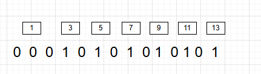

参考灵神： [从集合论到位运算，常见位运算技巧分类总结！](https://leetcode.cn/discuss/post/3571304/cong-ji-he-lun-dao-wei-yun-suan-chang-ji-enve/)
## 1、利用位运算求集合交并集
集合可以用二进制表示，二进制从低到高第 i 位为 1 表示 i 在集合中，为 0 表示 i 不在集合中。例如集合 {0,2,3} 可以用二进制数 1101(2)表示；反过来，二进制数 1101<sub>(2)</sub>就对应着集合 {0,2,3}。
正式地说，包含**非负整数**的集合 S 可以用如下方式「压缩」成一个数字：
\[
f(S) = \sum_{i \in S} 2^i
\]
例如集合 {0,2,3} 可以压缩成2<sup>0</sup>+2<sup>1</sup>+2<sup>2</sup>+2<sup>3</sup>=13，也就是二进制数 1101<sub>(2)</sub>
eg:
比如求两个非负集合的交集数量  A = [1,3,5,7,9,11,13] 和 B = [1,2,3,5,7,13,15]
可以将A转化为一个正整数:
<div align = center>
</div>
也就是 2<sup>1</sup>+2<sup>3</sup>+2<sup>4</sup>+2<sup>7</sup>+2<sup>9</sup>+2<sup>11</sup>+2<sup>13</sup>
将这个过程转化为代码的操作

```python
    A = [0, 3, 5, 7, 9, 11, 13]
    ans = 0
    for x in A:
        ans = ans | 1 << x
    print(ans)
```

这行代码的意思是将 ans 与 1 << x 的结果进行按位或（OR）操作，并将结果赋值给 p。这里 1 << x 是一个二进制位左移操作，它将数字 1 左移 x 位。例如，如果 x 是 3，则 1 << 3 的结果是二进制的 1000 或者十进制中的 8。
每次循环时，如果 x 对应的位置还没有被标记（即该位置的比特位为 0），那么这一行代码将会把 p 的第 x 个比特位 置为1。这是在为 a 列表中的每个元素创建一个位图表示。
因此集合A转化为正整数为：10922 （ 0b10101010101010）

同理可以将B也转化为一个整数

```python
B = [1, 2, 3, 5, 7, 13, 15]
ans = 0
for i in B:
    ans = ans | 1 << i
print(ans)
```
两个集合的交集可以直接用 & 来计算，因为 & 两个均为1的位置上的比特位置为1，其余则均为0

```python
A = [1, 3, 5, 7, 9, 11, 13]
B = [1, 2, 3, 5, 7, 13, 15]
p = 0
q = 0
for x in A:
    p = p | 1 << x
for y in B:
    q = q | 1 << y
print((p & q).bit_count())
```
输出 5 
两个数的交集数量为5

[leetcode2657](https://leetcode.cn/problems/find-the-prefix-common-array-of-two-arrays/description/)

```python
from typing import List


class Solution:
    def findThePrefixCommonArray(self, A: List[int], B: List[int]) -> List[int]:
        p = q = 0
        ans = []
        for x, y in zip(A, B):
            p = p | 1 << x
            q = q | 1 << y
            ans.append((p & q).bit_count())
        return ans


if __name__ == "__main__":
    A = [1, 3, 2, 4]
    B = [3, 1, 2, 4]
    a = Solution().findThePrefixCommonArray(A, B)
    print(a)
```

## 通过这种方法，我们可以快速判断一个元素是否在集合中

**leecode3115为例**

给你一个整数数组 nums。返回两个（不一定不同的）质数在 nums 中 下标 的 最大距离。

由于题目告诉了数组元素的范围：

提示：
- 1 <= nums.length <= 3 * 105
- 1 <= nums[i] <= 100
- 输入保证 nums 中至少有一个质数。

所以，可以将1-100之间的质数，整理到一个集合

方法1：
```python
class Solution:
    def __init__(self):            
        self.primes_list = [
            2, 3, 5, 7, 11, 13, 17, 19, 23, 29,
            31, 37, 41, 43, 47, 53, 59, 61, 67,
            71, 73, 79, 83, 89, 97
        ]

    def maximumPrimeDifference(self, nums: List[int]) -> int:
        left,right = 0,len(nums)-1
        while nums[left] not in self.primes_list:
            left += 1
        while nums[right] not in self.primes_list:
            right -= 1
        return right - left
if __name__ == "__main__":
    print(Solution().maximumPrimeDifference([4,2,9,5,3]))
```

方法2：

由于100以内的质数只有25个，我们可以将这个集合压缩成一个数

```python

    def __init__(self):            
        self.primes_list = [
            2, 3, 5, 7, 11, 13, 17, 19, 23, 29,
            31, 37, 41, 43, 47, 53, 59, 61, 67,
            71, 73, 79, 83, 89, 97
        ]
        self.PRIME_MASK = sum([2**i for i in self.primes_list])
```

根据位运算判断该元素是否在集合中，比如：上述代码中的PRIME_MASK的值为：`159085582874019712269820766380`

计算的方式为： `2^2`+`2^3`+`2^5`+`2^11` +...+`2^97` 那么转化为2进制就是：第0位是0，第一位是0，**第二位是1，第三位是1**，第四位是0，**第五位是1**，....，**第97位是1**

那么如果我们想判断 5 是否在这个集合中，只需要判断 PRIME_MASK 第五位上的二进制数是否为1就可以了， 如果为1， 那么5 就在集合中，反之，则不在集合中

```python

class Solution:
    def __init__(self):            
        self.primes_list = [
            2, 3, 5, 7, 11, 13, 17, 19, 23, 29,
            31, 37, 41, 43, 47, 53, 59, 61, 67,
            71, 73, 79, 83, 89, 97
        ]
        self.PRIME_MASK = sum([2**i for i in self.primes_list])
    
    def maximumPrimeDifference(self, nums: List[int]) -> int:
        left,right = 0,len(nums)-1
        while self.PRIME_MASK >> nums[left] & 1 == 0:
            left += 1
        while self.PRIME_MASK >> nums[right] & 1 ==0:
            right -= 1
        return right - left
if __name__ == "__main__":
    print(Solution().maximumPrimeDifference([4,2,9,5,3]))
```

其中 self.PRIME_MASK >> nums[left] & 1 == 0 就说明nums[left]不在集合中

因为 self.PRIME_MASK >> nums[left] 相当于将PRIME_MASK的二进制的第0，1，2，3，4位，全部去掉了(还是以判断5是否在集合中为例),那么再 & 1， 相当于就是判断 self.PRIME_MASK >> nums[left] 第0位是否为1（也就是判断原来的第五位是否是1)